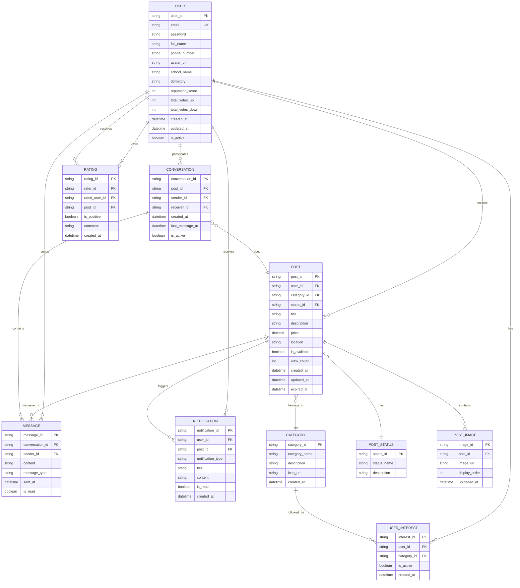

# 📊 Sơ đồ ERD - Dự án ShareIn

## Mô tả dự án
**ShareIn** là nền tảng chia sẻ, trao đổi và mua bán đồ cũ dành cho sinh viên trong trường/ký túc xá.

---

## 🗂️ Sơ đồ ERD (Entity-Relationship Diagram)

---

## 📋 Mô tả các Entity chính

### 1️⃣ USER (Người dùng)
**Mục đích:** Lưu trữ thông tin người dùng (sinh viên)

**Thuộc tính chính:**
- `user_id`: ID duy nhất của người dùng
- `email`: Email đăng nhập (unique)
- `reputation_score`: Điểm uy tín tổng hợp
- `total_votes_up/down`: Số lượng vote tích cực/tiêu cực
- `school_name`, `dormitory`: Thông tin trường/ký túc xá

---

### 2️⃣ POST (Bài đăng)
**Mục đích:** Lưu trữ thông tin các món đồ được chia sẻ

**Thuộc tính chính:**
- `post_id`: ID duy nhất của bài đăng
- `title`, `description`: Tiêu đề và mô tả món đồ
- `price`: Giá (nếu bán)
- `location`: Vị trí trong trường/ký túc xá
- `is_available`: Trạng thái còn/hết

**Quan hệ:**
- Một USER có thể tạo nhiều POST
- Một POST thuộc một CATEGORY
- Một POST có một POST_STATUS (cho/đổi/bán rẻ)

---

### 3️⃣ CATEGORY (Danh mục)
**Mục đích:** Phân loại các món đồ

**Ví dụ danh mục:**
- Sách giáo trình
- Đồ điện tử
- Quần áo
- Đồ dùng học tập
- Nội thất phòng trọ

---

### 4️⃣ POST_STATUS (Trạng thái bài đăng)
**Mục đích:** Xác định loại giao dịch

**Các giá trị:**
- `CHO_MIEN_PHI`: Cho miễn phí
- `DOI_DO`: Đổi đồ
- `BAN_RE`: Bán rẻ

---

### 5️⃣ POST_IMAGE (Hình ảnh bài đăng)
**Mục đích:** Lưu trữ nhiều ảnh cho mỗi bài đăng

**Thuộc tính chính:**
- `display_order`: Thứ tự hiển thị ảnh

---

### 6️⃣ CONVERSATION (Cuộc hội thoại)
**Mục đích:** Quản lý các cuộc chat giữa người đăng và người quan tâm

**Quan hệ:**
- Một CONVERSATION liên quan đến một POST cụ thể
- Một CONVERSATION có hai người tham gia (sender & receiver)
- Một CONVERSATION chứa nhiều MESSAGE

---

### 7️⃣ MESSAGE (Tin nhắn)
**Mục đích:** Lưu trữ nội dung chat trực tiếp

**Thuộc tính chính:**
- `message_type`: text, image, location
- `is_read`: Đã đọc hay chưa

---

### 8️⃣ NOTIFICATION (Thông báo)
**Mục đích:** Gửi thông báo khi có món đồ mới theo danh mục quan tâm

**Các loại thông báo:**
- `NEW_POST_IN_INTEREST`: Có món mới trong danh mục quan tâm
- `NEW_MESSAGE`: Có tin nhắn mới
- `POST_EXPIRED`: Bài đăng sắp hết hạn
- `NEW_RATING`: Nhận đánh giá mới

---

### 9️⃣ USER_INTEREST (Danh mục quan tâm)
**Mục đích:** Lưu trữ danh mục mà người dùng theo dõi

**Cách hoạt động:**
- User chọn các danh mục quan tâm
- Khi có POST mới trong danh mục → tạo NOTIFICATION

---

### 🔟 RATING (Đánh giá uy tín)
**Mục đích:** Hệ thống vote 👍/👎 để xây dựng uy tín

**Thuộc tính chính:**
- `is_positive`: true (👍) hoặc false (👎)
- `comment`: Nhận xét (tùy chọn)

**Quan hệ:**
- Một USER (rater) đánh giá một USER khác (rated_user)
- Liên quan đến một POST cụ thể

---

## 🔗 Các mối quan hệ chính

| **Quan hệ** | **Loại** | **Mô tả** |
|-------------|----------|-----------|
| USER - POST | 1:N | Một người dùng có thể tạo nhiều bài đăng |
| POST - CATEGORY | N:1 | Nhiều bài đăng thuộc một danh mục |
| POST - POST_STATUS | N:1 | Nhiều bài đăng có cùng trạng thái |
| POST - POST_IMAGE | 1:N | Một bài đăng có nhiều hình ảnh |
| USER - CONVERSATION | 1:N | Một người dùng tham gia nhiều cuộc hội thoại |
| CONVERSATION - MESSAGE | 1:N | Một cuộc hội thoại có nhiều tin nhắn |
| USER - NOTIFICATION | 1:N | Một người dùng nhận nhiều thông báo |
| USER - USER_INTEREST | 1:N | Một người dùng theo dõi nhiều danh mục |
| CATEGORY - USER_INTEREST | 1:N | Một danh mục được nhiều người theo dõi |
| USER - RATING | 1:N | Một người dùng có thể đánh giá nhiều người khác |

---

## 🎯 Ánh xạ Tính năng MVP với ERD

| **Tính năng MVP** | **Entity liên quan** |
|-------------------|---------------------|
| **1️⃣ Đăng tin nhanh** | USER, POST, POST_IMAGE, CATEGORY, POST_STATUS |
| **2️⃣ Tìm kiếm & lọc danh mục** | POST, CATEGORY, POST_STATUS |
| **3️⃣ Chat trực tiếp** | USER, CONVERSATION, MESSAGE, POST |
| **4️⃣ Thông báo theo danh mục quan tâm** | USER_INTEREST, NOTIFICATION, CATEGORY, POST |
| **5️⃣ Đánh giá uy tín (Vote)** | RATING, USER |

---

---

✍️ _Được tạo cho dự án ShareIn - L01_MobileApp - 10/2025_

